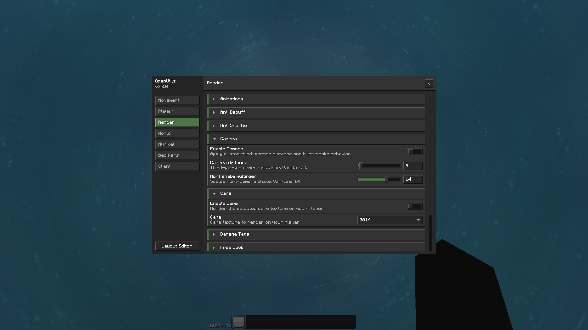
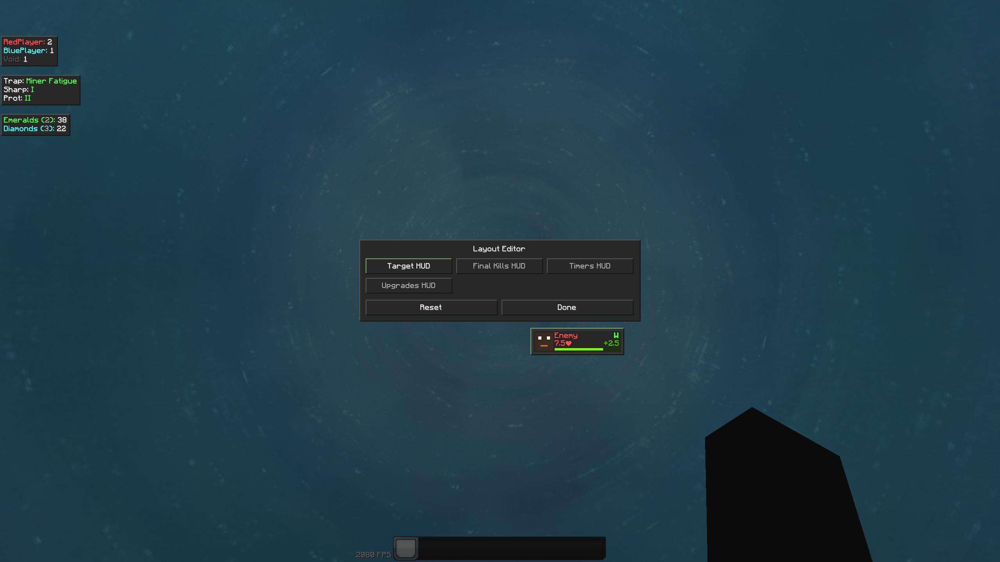

<h1 align="center">OpenUtils</h1>

<p align="center">
  <a href="https://github.com/zhgmx/OpenUtils/releases/latest"></a>
  
  <a href="https://github.com/zhgmx/OpenUtils/actions/workflows/release.yml"></a>
  <a href="LICENSE"></a>
</p>

`OpenUtils` is an open-source Minecraft 1.8.9 Forge utility mod for client-side gameplay, HUD and Hypixel features.
It is built for players who want practical quality-of-life tools that stay available, readable, and easy to fork.

<table align="center">
  <tr>
    <td align="center">
      <br>
      <sub>Settings</sub>
    </td>
    <td align="center">
      <br>
      <sub>Layout Editor</sub>
    </td>
  </tr>
</table>

## Features

<details>
<summary>View feature list</summary>

- No Jump Delay
- Snap Tap
- Sprint
- Action Sounds
- No Break Delay
- No Hit Delay
- Animations
- Anti Debuff
- Anti Shuffle
- Camera
- Cape
- Damage Tags
- Free Look
- Name Hider
- Target HUD
- Thick Rods
- Time Changer
- Auto GG
- Denicker
- Quick Math
- Armor Alerts
- Final Kills HUD
- Item Alerts
- Quick Shop
- Resource Count
- Timers HUD
- Upgrade Alerts
- Upgrades HUD
- Debug
- VPN Status

</details>

## Install

Download the latest jar from the [releases page](https://github.com/zhgmx/OpenUtils/releases/latest) and place it in your Forge 1.8.9 `mods` folder.

## Build

```bash
./gradlew spotlessCheck compileJava assemble
```

The Forge jar is written to:

```text
build/libs/OpenUtils-<version>-forge.jar
```

For a development client:

```bash
./gradlew runClient
```

## Contributing

Small, focused pull requests are easiest to review.
Please follow the existing formatting and keep changes scoped to the feature or system you are touching.

## License

OpenUtils is licensed under the **GNU General Public License v3.0**.

OpenUtils is provided without warranty. Minecraft and related trademarks belong to their respective owners.
